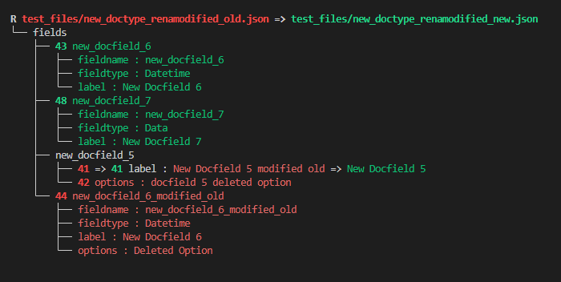

# Frappe Schema JSON Diff 

## Usage
### Local Testing
Call the script and pass three arguments:
1. Path to text file containing git statuses and paths to (copied) files from head commit.
2. Path to text file containing git statuses and paths to files from base commit.
3. Boolean for printing tables (1) or trees (0).

Sample Frappe JSON files and a VSCode launch configuration are included to quickly get started:  
`git clone --recurse-submodules https://github.com/robproject/fsjd.git`  
`cd fsjd && pip install -r requirements.txt && code .`  
Press f5

### CI Implementation
Copy `main.yaml` along with the `.github/workflows` parent directories into the root folder of a custom app. Change the branch on lines 4 and 6 if applicable. Keep the `1` on line 71 to print table diffs or change it to `0` for trees.

## Output
Runner terminals will show all JSON file names and git statuses, and any diff contents for those which are renamed or modified. If any schema changes (changed JSON) are present, the workflow will fail.  
### CI Terminal
[example](https://github.com/robproject/fsjd/runs/7799952536?check_suite_focus=true#step:8:5)  
### Table

### Tree

## Design
### Dependencies
| Name                | Purpose                               | Links                                                                                                            |
| ------------------- | ------------------------------------- | ---------------------------------------------------------------------------------------------------------------- |
| **json-source-map** | Fetching line numbers for diffed data | [PyPI](https://pypi.org/project/json-source-map/) [GitHub](https://github.com/open-alchemy/json-source-map/wiki) |
| **Rich**            | Python output formatting              | [PyPI](https://pypi.org/project/rich/)             [GitHub](https://github.com/Textualize/rich)                  |
### Github Actions
Workflow `main.yaml` performs the following steps:
1. Checkout action gets the two latest commits. 
2. Changed-files action gets all changed json.
3. Changed files are copied to a directory `head/` while their new paths and git status are listed in a file `acmr.txt`.
4. Git checks out the base commit.
5. Git status and changed file paths of base files are listed in file `base/mrd.txt`.
6. Script can be called since both versions of files are accessible.
### Function
A specific situation this tool is designed to account for is the deletion or reordering of elements in a list of dictionaries. If docfields (dictionaries) are added, deleted, or have their order changed, tools like DeepDiff will compare elements of the same index. FSJD will compare members of dictionary lists with matching common-key values. For example, docfields share the common-key 'field_name', so if two lists to be diffed contain dictionaries with this common-key, and their values match, those two dictionaries will be compared regardless of index. The tradeoff to this approach is that renaming a docfield (changing only the value of a common-key) will show a deleted and added docfield instead of a renamed value.
